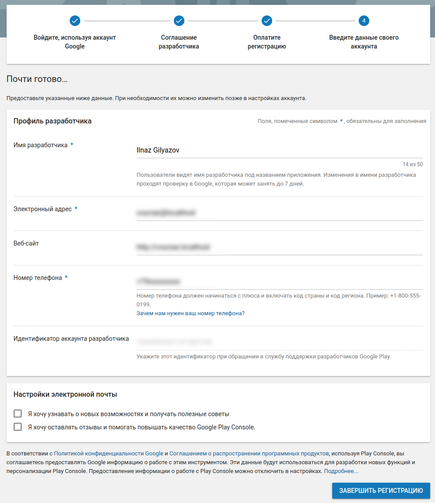
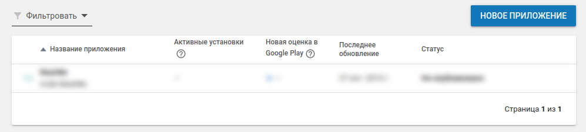
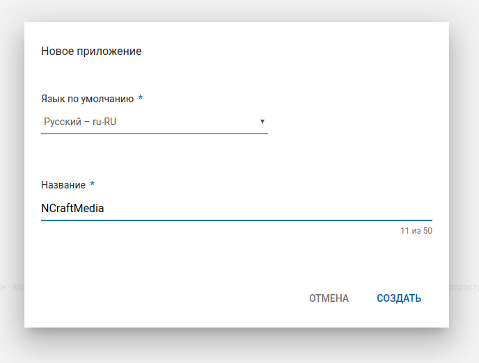
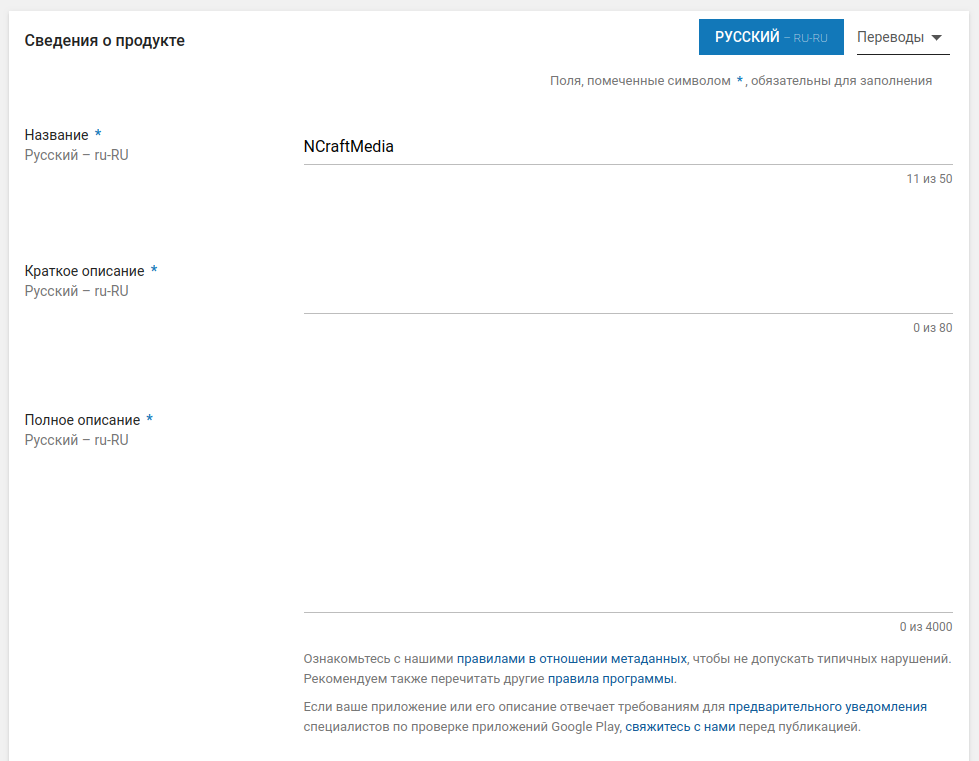
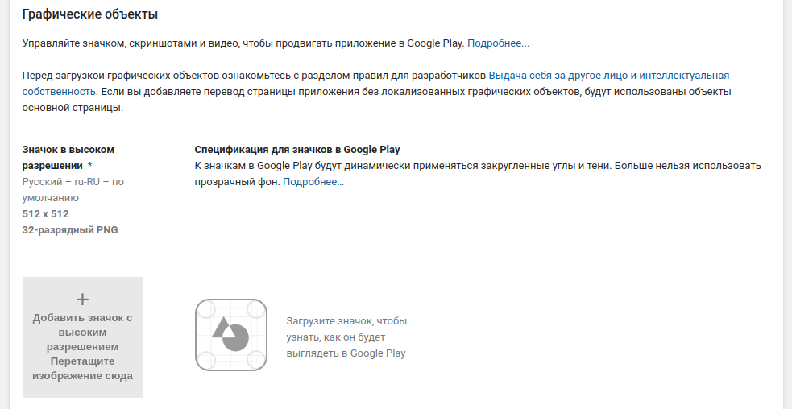
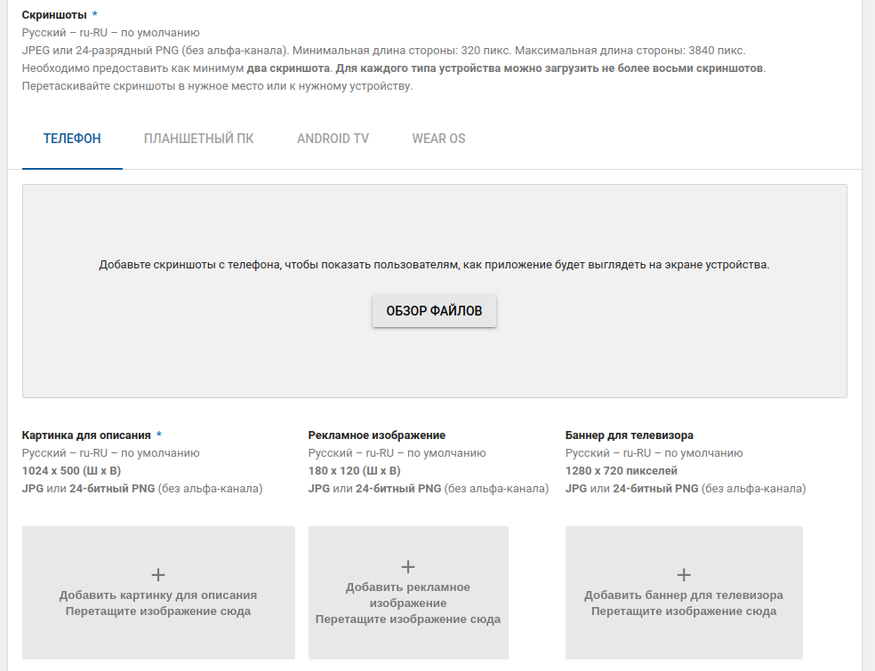
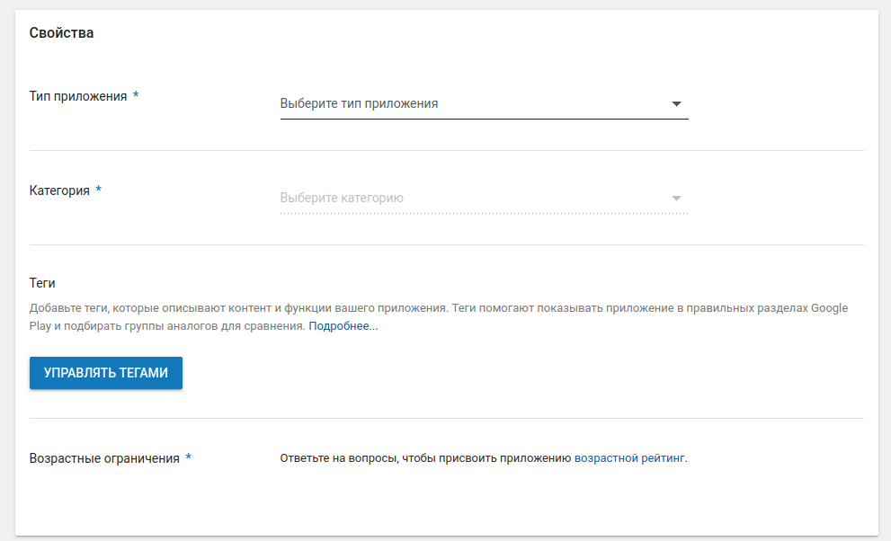
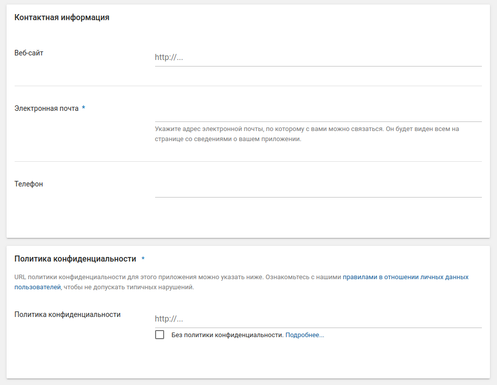
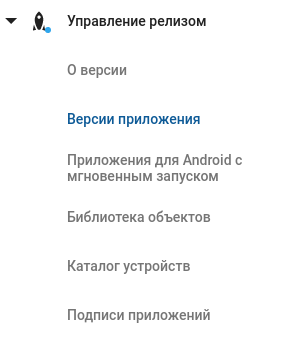
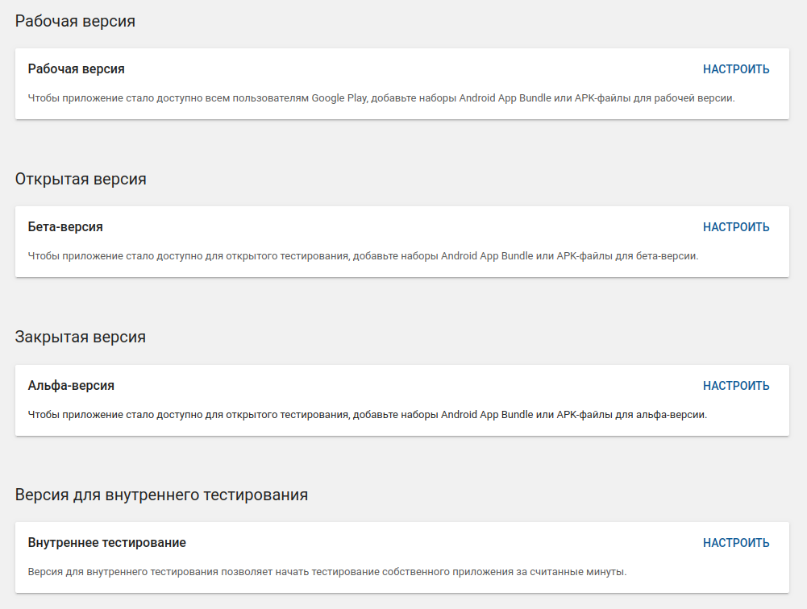

В этом кратком руководстве описано, как зарегистрироваться и опубликовать ваше приложение в Google Play.

## Регистрация аккаунта

Первое, что необходимо сделать, это зарегистрировать аккаунт разработчика Google Play:

1. Переходите на сайт: https://play.google.com/apps/publish/signup
1. Принимаете соглашение Google Play
1. Платите пошлину в 25$
1. Заполняете необходимую информацию о себе (пример)*:

Примечание:* если вы планируете осуществлять продажи внутри приложения (через in-app purchases), то вам дополнительно нужно будет настроить мерчант аккаунт.

## Создание проекта

После нажатия на кнопку завершить регистрацию вы попадает в консоль управления (либо можете просто перейти по ссылке https://play.google.com/apps/publish):

Нажав на кнопку "Новое приложение" появится всплывающее окно для добавления нового приложения:

После чего вы попадёте в мастер создания нового проекта, в котором необходимо будет заполнить поля, отмеченные звёздочкой:

Чтобы загрузить APK, необходимо для нужного приложения из бокового меню выбрать "Управление релизом" -> "Версии приложения":

На открывшейся странице стоит выбрать то, какой релиз вы хотите создать (альфа, бета или рабочий) и загрузить APK-файл:

## Подпись APK

В Google Play принимаются только подписанные APK.