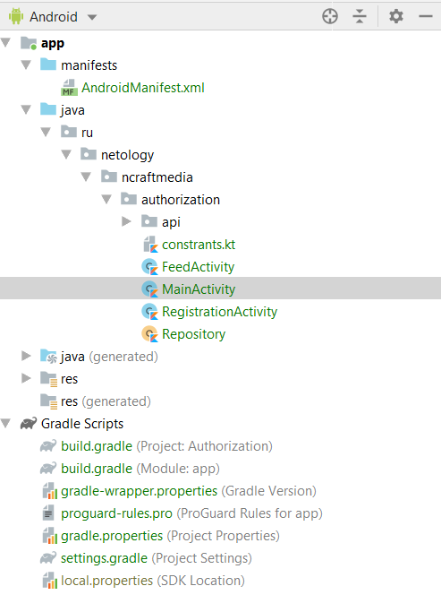
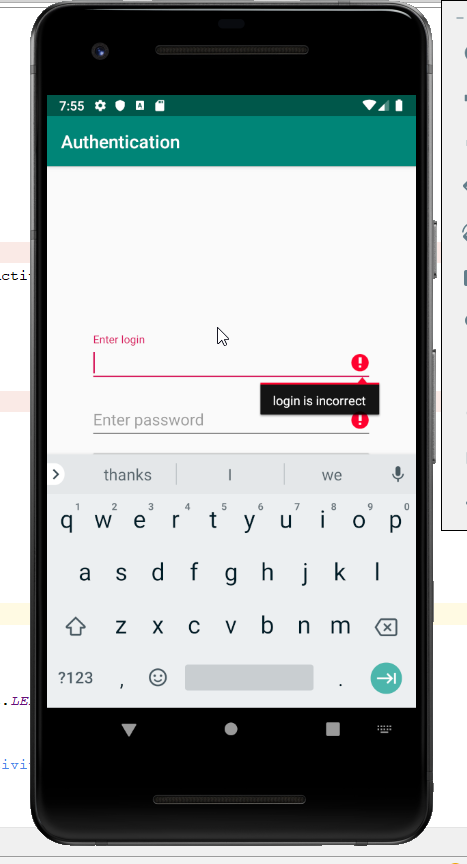

# Домашнее задание к лекции "Android: Activity, навигация, авторизация"

Для каждой задачи создайте решение на базе Gradle и залейте его в GitHub.

Для этого ДЗ вы можете сдавать всё в виде одного проекта*, где финальный проект содержит решение всех трёх задач.

Все проекты должны быть созданы с использованием Gradle (без него не принимаются).

Важно: серверная часть должна быть выложена на Heroku, в README.md должен быть прописан URL вашего приложения.

Вы можете использовать серверную часть из кода к лекции, но, возможно, вам придётся доработать некоторые методы, т.к. они были в ваших предыдущих ДЗ.

Не забудьте про [.gitignore](../.gitignore)

## Задача №1 - Anko и ProgressDialog

Итак, напомню, что мы изучили библиотеку Anko и ее возможности.

Вам необходимо взять код `MainActivity` с лекции и выполните следующее:
1. Заменить стандартный код на использование Anko там, где это возможно. А именно:
    * Заменить Toast на Anko Toast
    * Заменить переход на новые экраны через Anko Intents Builders
2. Добавить ProgressDialog из Anko, запускать его во время авторизации и убирать при успешной/неуспешной авторизации, а так же в методе `onStop()`, т.к. мы отменяем там авторизацию.

Примечание:* рекомендуется использовать `indeterminateProgressDialog`, который нельзя отключить из пользовательского интерфейса или с помощью нажатия кнопки "Назад".
```kotlin
dialog = indeterminateProgressDialog(message = R.string.please_wait, title = R.string.authentication) {
    setCancelable(false)
}
```

Не забудьте добавить зависимости используемых Anko библиотек в gradle-файл вашего модуля.

Напомню, что для работы нам так же надо добавить в приложение компоненты и зависимости, которые были рассмотрены в лекции.



___

## Задача №2 - Регистрация

Чтобы пользователь авторизовался, он должен перед этим зарегистрироваться. Вам предстоит самостоятельно реализовать экран регистрации.

Для начала нам нужен проект с первого задания. Работать будем с файлами `RegistrationActivity`  и `activity_registration.xml` (разметка экрана регистрации, находится в `res/layout` и генерируется автоматически при добавлении activity).

Нам нужны 3 поля для ввода текста (логин, пароль, повторение пароля) и кнопка "Зарегистрировать". 
Желательно для этого воспользоваться той же структурой разметки, что и в `MainActivity`. Т.е. использовать `ConstraintLayout` и `chains` со стилем `app:layout_constraintVertical_chainStyle="packed"`, что бы `View` находились посередине.

В наш файл `API` следует добавить API для регистрации (посылать на `API` будем логин и пароль, а получать токен, так же как и при авторизации).

<details>
    <summary>Подсказка</summary>

    ```kotlin
    ...

    // Токен для последущих запросов
    data class Token(val token: String)

    // Данные для регистрации
    data class RegistrationRequestParams(val username: String, val password: String)

    interface API {
    ...
        @POST("api/v1/registration")
        suspend fun register(@Body registrationRequestParams: RegistrationRequestParams): Response<Token>
    }
    ```

    Теперь этот API нам надо вызывать из нашего репозитория `Repository`.

    ```kotlin
    package ru.netology.ncraftmedia.authorization

    ...

    object Repository {

    ...
        suspend fun register(login: String, password: String) =
            API.register(RegistrationRequestParams(login, password))
    }
    ```
</details>

Вам остается аналогично `MainActivity` реализовать код регистрации. После успешной регистрации нам надо сохранять токен. Но (в отличие от `MainActivity`) мы не будем переходить на экран `FeedActivity`, а просто завершим текущее(как думаете, почему?).

Кроме того, нам надо проверять при нажатии на кнопку регистрации совпадают ли введенные пароли и если они не совпадают, то показывать соответствующий Toast.

## Задача №3 (необязательная) - Валидация

Давайте с вами зададим следующие правила для логина и пароля:
* максимальная длина логина - 10 символов; 
* минимальная длина пароля - 6 символов. Максимальная длина пароля - 15 символов. Пароль должен состоять только из латинских символов и цифр.

Соотвествующие сообщения нужно выводить во `View`.

**Ваша задача реализовать эти проверки на экранах аутентификации и регистрации.**

Для вывода сообщения ошибки в `TextInputEditText` используется свойство `error`. При установлении в соответствующем поле ошибки, например, `loginEdit.error = "error"`, это поле помечается красной иконкой слева, а если оно находится в фокусе, то отображается текст ошибки.



Для задания максимальной длины вводимых данных используется атрибут `android:maxLength`. Для проверки минимальной длины и ограничений пароля мы воспользуемся [регулярными выражениями](https://ru.wikipedia.org/wiki/%D0%A0%D0%B5%D0%B3%D1%83%D0%BB%D1%8F%D1%80%D0%BD%D1%8B%D0%B5_%D0%B2%D1%8B%D1%80%D0%B0%D0%B6%D0%B5%D0%BD%D0%B8%D1%8F).

Для этого нам нужно создать паттерн. Воспользуемся следующим ограничением для нашего паттерна `(?=.*[A-Z])(?!.*[^a-zA-Z0-9])(.{6,})$`

В итоге наша функция првоерки будет иметь следующий вид:
```kotlin
/**
    * Minimum is 6 chars. Should be at least one capital letter. Allow only english characters and
    * numbers
    */
fun isValid(password: String) =
    Pattern.compile("(?=.*[A-Z])(?!.*[^a-zA-Z0-9])(.{6,})\$").matcher(password).matches()
```

Эту функцию лучше вынести в файл `Utils`, что бы использовать ее в любом месте.