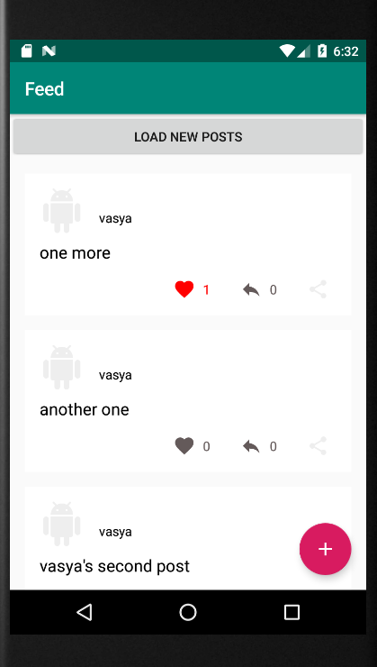

# Домашнее задание к лекции "Android: Загрузка данных по API, CRUD"

Для каждой задачи создайте решение на базе Gradle и залейте его в GitHub.

В качестве API вы можете использовать либо собственное, либо то, что находится в репозитории с кодом к лекциям (но вам придётся его доработать).

API должно быть выложено на Heroku, а в README.md прописан его URL.

---

## Задача №1 - Добавить репосты в приложение.

У нас есть обычные посты. Мы умеем отправлять лайки. В предыдущих домашних заданиях мы также делали репосты. Пора их использовать.

Ваша задача реализовать функционал репостов.
API вы реализовывали в предыдущих практических занятиях.

```
api/v1/posts/1/reposts 
{
    content": "Funny post"
}
```

А также отображать репосты у себя на странице. (Использовать `RecyclerView` с разными типами)

***Напомню, что репостить репосты не надо. В данном курсе это не предусмотрено.***

Остается при нажатии на кнопку репоста отобразить диалог для ввода контента похожий на тот, который отображается при создании обычного поста.

После ввода диалога нужно отправить соответствующий запрос на сервер. Логика обработки запроса и ожидание ответа такая же, как при лайках (пока запрос проходит отображать синий цвет - использовать доп. флаг).

Рекомендуется использовать следующую модель:
```kotlin
data class PostModel(
  val id: Long,
  val source: PostModel? = null,
  val ownerId: Long,
  val ownerName: String,
  val created: Int,
  var content: String? = null,
  var likes: Int = 0,
  var likedByMe: Boolean = false,
  var reposts: Int = 0,
  var repostedByMe: Boolean = false,
  val link: String? = null,
  val type: PostType = PostType.POST,
  val attachment: AttachmentModel?
) {
  var likeActionPerforming = false
  var repostActionPerforming = false
  // После получения поста обратно обновляем данные, которые можно обновить
  fun updatePost(updatedModel: PostModel) {
    if (id != updatedModel.id) throw IllegalAccessException("Ids are different")
    likes = updatedModel.likes
    likedByMe = updatedModel.likedByMe
    content = updatedModel.content
    reposts = updatedModel.reposts
    repostedByMe = updatedModel.repostedByMe
  }
}
```

Для диалога можно использовать следующий код xml(`create_post` аналогичен разметке для создания поста. Учтите, что, если `editText` будет иметь высоту `wrap_content`, то он может сжаться в диалоге. Поэтому устанавливайте минимальную высоту `app:layout_constraintHeight_min="250dp"` и экспериментируйте):

```kotlin
fun showDialog(context: Context, createBtnClicked: (content: String) -> Unit) {
  val dialog = AlertDialog.Builder(context)
    .setView(R.layout.create_post)
    .show()
  dialog.createPostBtn.setOnClickListener {
    createBtnClicked(dialog.contentEdt.text.toString())
    dialog.dismiss()
  }
}

```

Адаптер:
```kotlin
class PostAdapter(val list: List<PostModel>) : RecyclerView.Adapter<RecyclerView.ViewHolder>() {
  private val ITEM_TYPE_POST = 1
  private val ITEM_TYPE_REPOST = 2

  override fun onCreateViewHolder(parent: ViewGroup, viewType: Int): RecyclerView.ViewHolder {

    return if (viewType == ITEM_TYPE_POST) {
      val postView =
        LayoutInflater.from(parent.context).inflate(R.layout.item_post, parent, false)
      PostViewHolder(this, postView)
    } else {
      val repostView =
        LayoutInflater.from(parent.context).inflate(R.layout.item_repost, parent, false)
      RepostViewHolder(this, repostView)
    }
  }

  override fun getItemCount() = list.size

  override fun onBindViewHolder(holder: RecyclerView.ViewHolder, position: Int) {
    when(holder){
      is PostViewHolder -> holder.bind(list[position])
      is RepostViewHolder -> holder.bind(list[position])
    }
  }

  override fun getItemViewType(position: Int): Int {
    return if (list[position].source == null) {
      ITEM_TYPE_POST
    } else ITEM_TYPE_REPOST
  }
}

class RepostViewHolder(val adapter: PostAdapter, view: View) : RecyclerView.ViewHolder(view) {
  ...
}

class PostViewHolder(val adapter: PostAdapter, view: View) : RecyclerView.ViewHolder(view) {
  init {
    with(itemView) {
      likeBtn.setOnClickListener {
        val currentPosition = adapterPosition
        if (currentPosition != RecyclerView.NO_POSITION) {
          val item = adapter.list[currentPosition]
          if (item.likeActionPerforming) {
            context.toast("Like is performing")
          } else {
            GlobalScope.launch(Dispatchers.Main) {
              item.likeActionPerforming = true
              adapter.notifyItemChanged(currentPosition)
              val response = if (item.likedByMe) {
                Repository.cancelMyLike(item.id)
              } else {
                Repository.likedByMe(item.id)
              }
              item.likeActionPerforming = false
              if (response.isSuccessful) {
                item.updatePost(response.body()!!)
              }
              adapter.notifyItemChanged(currentPosition)
            }
          }
        }
      }
      repostsBtn.setOnClickListener {
        val currentPosition = adapterPosition
        if (currentPosition != RecyclerView.NO_POSITION) {
          val item = adapter.list[adapterPosition]
          if (item.repostedByMe) {
            context.toast("Can't repost repost)")
          } else {
            showDialog(context) {
              GlobalScope.launch(Dispatchers.Main) {
                item.repostActionPerforming = true
                adapter.notifyItemChanged(currentPosition)
                val response = Repository.makeRepost(item.id, it)
                item.repostActionPerforming = false
                if (response.isSuccessful) {
                  item.updatePost(response.body()!!)
                }
                adapter.notifyItemChanged(currentPosition)
              }
            }
          }
        }
      }
...
    }
  }

  fun bind(post: PostModel) {
    with(itemView) {
      authorTv.text = post.ownerName
      contentTv.text = post.content
      likesTv.text = post.likes.toString()
      repostsTv.text = post.reposts.toString()

      if (post.likeActionPerforming) {
        likeBtn.setImageResource(R.drawable.ic_favorite_pending_24dp)
      } else if (post.likedByMe) {
        likeBtn.setImageResource(R.drawable.ic_favorite_active_24dp)
        likesTv.setTextColor(ContextCompat.getColor(context, R.color.colorRed))
      } else {
        likeBtn.setImageResource(R.drawable.ic_favorite_inactive_24dp)
        likesTv.setTextColor(ContextCompat.getColor(context, R.color.colorBrown))
      }

      if (post.repostActionPerforming) {
        repostsBtn.setImageResource(R.drawable.ic_reposts_pending)
      } else if (post.repostedByMe) {
        repostsBtn.setImageResource(R.drawable.ic_reposts_active)
        repostsTv.setTextColor(ContextCompat.getColor(context, R.color.colorRed))
      } else {
        repostsBtn.setImageResource(R.drawable.ic_reposts_inactive)
        repostsTv.setTextColor(ContextCompat.getColor(context, R.color.colorBrown))
      }
    }
  }
}

```
---

## Задача №2 - реализовать добавление новых постов и загрузку дополнительных.

Итак постов у нас может быть огромное колличество. Если мы их все загрузим сразу, то наша память может взорваться (её не хватит).

Ваша задача при входе в приложение загружать наиболее свежие новости. А в конце последнего поста и перед началом самого первого добавить кнопку "загрузить еще" и "Загрузить новые" соответственно.

При нажатии на кнопки делаете запрос на соответствующие API и добавляете посты в адаптер, если новых или дополнительных постов нет, выводите соответствующее сообщение.
Для этого надо:
* Заменить API для получения всех постов, на API для получения только самых свежих `api/v1/posts/recent`
* В адаптер добавить два новых вида - Header (кнопка "загрузить новые") и Footer (кнопка "загрузить еще")

Для этого стоит использовать два новых типа:
```kotlin
  private val ITEM_FOOTER = 3;
  private val ITEM_HEADER = 4
```

Теперь кол-во элементов в адаптере можно возвращать следующим образом:
```kotlin
  // items + 1 footer +1 header
  override fun getItemCount() = list.size + 2
```

Соответственно, первый элемент у нас будет header, потом элементы массива, потом footer
```kotlin
  override fun getItemViewType(position: Int): Int {
    Log.v("test","getitem type by position "+position)
    return when {
      position == 0 -> ITEM_HEADER
      position == list.size+1 -> ITEM_FOOTER
      // 0-я позиция header, 1-я позиция в адаптере
      // это 0-я позиция в списке постов. Соответственно, 
      // инкрементируем все значения
      list[position-1].source == null -> ITEM_TYPE_POST
      else -> ITEM_TYPE_REPOST
    }
  }
}
```

Метод `onCreateViewHolder`
```kotlin
  override fun onCreateViewHolder(parent: ViewGroup, viewType: Int): RecyclerView.ViewHolder {

    return if (viewType == ITEM_TYPE_POST) {
      val postView =
        LayoutInflater.from(parent.context).inflate(R.layout.item_post, parent, false)
      PostViewHolder(this, postView)
    } else if (viewType == ITEM_TYPE_REPOST) {
      val repostView =
        LayoutInflater.from(parent.context).inflate(R.layout.item_repost, parent, false)
      RepostViewHolder(this, repostView)
    } else if (viewType == ITEM_HEADER) {
      HeaderViewHolder(
        this,
        LayoutInflater.from(parent.context).inflate(R.layout.item_load_new, parent, false)
      )
    } else {
      FooterViewHolder(
        this,
        LayoutInflater.from(parent.context).inflate(R.layout.item_load_more, parent, false)
      )
    }
  }
```

Пример `item_load_new`:
```xml
<?xml version="1.0" encoding="utf-8"?>
<FrameLayout xmlns:android="http://schemas.android.com/apk/res/android"
    android:orientation="vertical" android:layout_width="match_parent"
    android:layout_height="wrap_content">
    <Button
        android:id="@+id/loadMoreBtn"
        android:layout_width="match_parent"
        android:layout_height="wrap_content"
        android:text="@string/load_new_posts"
        />
    <ProgressBar
        android:id="@+id/progressbar"
        android:visibility="gone"
        android:layout_gravity="center_horizontal"
        android:layout_width="wrap_content"
        android:layout_height="wrap_content"/>
</FrameLayout>
```

Пример HeaderViewHolder'а:

```kotlin
class HeaderViewHolder(val adapter: PostAdapter, view: View) : RecyclerView.ViewHolder(view) {
  init {
    with(itemView) {
      // Слушатель на кнопку
      loadNewBtn.setOnClickListener {
        // делаем кнопку неактивной пока идет запрос
        loadNewBtn.isEnabled = false
        // над кнопкой покажем progressBar
        progressbar.visibility = View.VISIBLE
        GlobalScope.launch(Dispatchers.Main) {
          // запрашиваем все посты после нашего первого поста
          // (он же самый последний)
          val response = Repository.getPostsAfter(adapter.list[0].id)
          // восстанавливаем справедливость
          progressbar.visibility = View.INVISIBLE
          loadNewBtn.isEnabled = true
          if (response.isSuccessful) {
            // Если все успешно, то новые элементы добавляем в начало
            // нашего списка.
            val newItems = response.body()!!
            adapter.list.addAll(0, newItems)
            // Оповещаем адаптер о новых элементах
            adapter.notifyItemRangeInserted(0, newItems.size)
          } else {
            context.toast("Error occured")
          }
        }
      }
    }
  }
}
```

Вам надо имплементировать вышеприведенный header, а также аналогичным способом добавить footer.

***Примечания*** 
* Ваш list в Adapter'е теперь должен быть MutableList, соответственно апи для последних постов должно возвращать его.
* В коде, везде, где раньше использовалась конструкция `list[position]`, теперь надо инкрементировать позицию на 1, потому что у нас 0-й элемент - это header. `list[position-1]`




# Задача № 3 (необязательная) - Swipe to refresh
Вместо кнопки для новых постов попробуйте реализовать swipe to refresh.

Для этих целей вам понадобится `SwipeRefreshLayout`. Добавить его можно при помощи gradle-зависимости

```groovy
dependencies {
    // ...
    implementation 'androidx.swiperefreshlayout:swiperefreshlayout:1.0.0'
}
```
Из adapter'a надо убрать тип Header. Не забыть там, где в предыдущем задании на один декрементировалось значение в `list[postition-1]` теперь сделать по нормальному. Также количество элементов на 1 уменьшается.
```kotlin
  // items + 1 footer
  override fun getItemCount() = list.size + 2
```
В основной разметке `RecyclerView` надо обернуть в `SwipeRefreshLayou`.
В`FeedActivity`
```kotlin
// FeedActivity.kt
...
    swipeContainer.setOnRefreshListener {
      refreshData()
    }
...    
private fun refreshData() {
    launch {
      val newData = Repository.getRecent()
      swipeContainer.isRefreshing = false
      if (newData.isSuccessful) {
        adapter?.newRecentPosts(newData.body()!!)
      }
    }
  }
```

Теперь при подходе к первому элементу мы можем потянуть вниз и у нас появится крутилка, после окончания загрузки эта крутилка исчезнет и данные обновлятся.