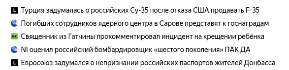

# Домашнее задание к лекции "Введение в Kotlin"

Для каждой задачи создайте решение на базе Gradle и залейте его в GitHub.

Для этого ДЗ вы можете сдавать всё в виде одного проекта, где каждая задача будет размещаться в собственном файле и пакете, например:
/src/main/kotlin:
- /ru/netology/purchase:
    - main.kt - main для первой задачи
    - Item.kt 
    - Cart.kt 
- /ru/netology/hiearcy
    - main.kt - main
    - view/View.kt
    - view/ViewGroup.kt
    - widget/Button.kt
    - widget/ToggleButton.kt
- /ru/netology/news
    - main.kt - main
    - model/NewsItem.kt
    - top/TopNews.kt
    - collection/OrderedBuffer.kt

## Задача №1 - Корзина покупок

Реализуйте на базе `LinkedList` корзину покупок `Cart`, содержащую следующую функциональность:
```kotlin
val iPhone = Item(1, 'iPhone XX', 100_000) // товар - артикул, название и стоимость
val galaxy = Item(2, 'Samsung Galaxy', 90_000)

val cart = Cart()
cart.add(iPhone, count=2) // сколько покупаем
println(cart.total) // 200_000 - read only поле (т.е. из total можно читать, но писать туда нельзя)
cart.add(galaxy) // по умолчанию, добавляется один
// теперь в корзине: iPhone - 2 шт, galaxy - 1 шт.
card.remove(iPhone, count=3) // ошибки нет, в корзине остался только galaxy
```

Сделайте так, чтобы `cart.total` вычислялось в момент обращения (не в момент добавления/удаления).

Подумайте, какой класс вам ещё необходимо добавить, чтобы хранить запись формата `товар - количество`.

## Задача №2 - Hierarcy

Вам поручили реализовать систему базовых виджетов для приложения:
- `View`
- `ViewGroup`
- `TextView`
- `Button`

### `View`

Базовый класс, от которого все наследуются. Содержит лишь один метод `click`, который выводит в консоль строку `View clicked`.

### `ViewGroup`

Класс, наследующийся от `View`, содержит методы `addView` и `removeView` (внутри хранит список `View` - воспользуйтесь написанным нами на лекции `LinkedList` для хранения списка `View`).

### `TextView`

Класс, наследующийся от `View`, содержит внутри текст. Пример использования:
```kotlin
val text = TextView("Some Text")
text.click() // вызывается метод из `View`
println(text.text) // Some Text
text.text = "Something bad happened"
println(text.text) // Something bad happened
```

### `Button`

Класс, наследующийся от `TextView`:
```kotlin
val button = Button("Click me")
button.click() // вызывается метод из `View`
println(button.text) // Click me
button.text = "Don't click me"
println(button.text) // Don't click me
```

### Результат

В результате вы должны иметь возможность создавать сколь угодно сложные иерархии `View`, например:

```kotlin
val main = ViewGroup()
val title = Text("Main Screen")
main.addView(title)
val content = ViewGroup()
val text = Text("Some interesting article preview")
val readMore = Button("Read more")
content.addView(text)
content.addView(readMore)
main.addView(content)
```


## Задача № 3 (необязательная) - Top News

Вы, наверное, достаточно часто видели ленту новостей, в которой висит фиксированное количество "ТОП"-новостей. Будем считать, что новости должны быть размещены по дате публикации.

Примерно так это выглядит на главной странице Яндекса*:



Примечание*: стоит отметить, что на Яндексе логика отображения немного другая (не по дате).

Что вам необходимо сделать: разработайте три класса - `NewsItem`, `TopNews` и `OrderedBuffer`.

### NewsItem

Data Class, задача которого хранить текст новости, ссылку на новость.

### TopNews

Класс, отвечающий за весь список, содержит операции просмотра списка и добавления элемента.

В полях содержит объект типа `OrderedBuffer`, который и отвечает за хранение данных.

### OrderedBuffer

Класс, отвечающий за абстрактное хранение данных в структуре, похожей на "Очередь" (FIFO).

Суть заключается в следующем:
1. Вы можете создать очередь определённого размера, например 5.
2. Добавление новых элементов происходит с помощью функции `add`. Элементы добавляются в конец.
3. При достижении количества элементов в очереди равным размеру, добавление нового элемента приводит к тому, что первый (самый старый) - удаляется.

Пример использования:

```kotlin
val buffer = OrderedBuffer(3) // размер - 3
buffer.add(NewsItem("Турция задумалась...", "https://lenta.ru/..."))
buffer.add(NewsItem("Погибших сотрудников ядерного...", "https://ria.ru/..."))
buffer.add(NewsItem("Священник из Гатчины...", "https://rt.ru/..."))
// буфер заполнен, в нём три элемента (при размере 3):
// 1. Турция задумалась...
// 2. Погибших сотрудников ядерного...
// 3. Священник из гатчины...
buffer.add(NewsItem("NI оценил российский...", "https://ria.ru/..."))
// теперь содержимое буфера выглядит вот так
// 1. Погибших сотрудников ядерного...
// 2. Священник из гатчины...
// 3. NI оценил российский...
```

Постройте `OrderedBuffer` с использованием тех знаний, что вы получили при построении связанного списка на лекции.
