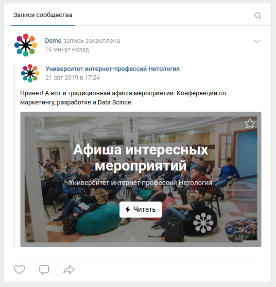

# Домашнее задание к лекции "Введение в Kotlin"

Для каждой задачи создайте решение на базе Gradle и залейте его в GitHub.

Для этого ДЗ вы можете сдавать всё в виде одного проекта, где каждая задача будет размещаться в собственном файле и пакете, например:
/src/main/kotlin:
- /ru/netology/profile:
    - main.kt - main для первой задачи
    - /model/Profile.kt 
- /ru/netology/hiearchy
    - main.kt - main
    - view/View.kt
    - view/ViewGroup.kt
    - widget/Button.kt
    - widget/ToggleButton.kt
- /ru/netology/social
    - main.kt - main
    - model/Post.kt

## Задача №1 - Профиль

Создайте класс `Profile`, позволяющий хранить информацию о пользователе:
* id
* логин
* Имя
* Фамилию
* Статус
* Аватар

Создайте вычисляемое поле `fullname`, с кастомным `get`, которое представляет из себя Имя + " " + Фамилия.

## Задача №2 - Hierarcy

Вам поручили реализовать систему базовых виджетов для приложения:
- `View`
- `ViewGroup`
- `TextView`
- `Button`

### `View`

Базовый класс, от которого все наследуются. Содержит лишь один метод `click`, который выводит в консоль строку `View clicked`.

### `ViewGroup`

Класс, наследующийся от `View`, содержит методы `addView` и `removeView` (внутри хранит список `View` - воспользуйтесь написанным нами на лекции `LinkedList` для хранения списка `View`).

### `TextView`

Класс, наследующийся от `View`, содержит внутри текст. Пример использования:
```kotlin
val text = TextView("Some Text")
text.click() // вызывается метод из `View`
println(text.text) // Some Text
text.text = "Something bad happened"
println(text.text) // Something bad happened
```

### `Button`

Класс, наследующийся от `TextView`:
```kotlin
val button = Button("Click me")
button.click() // вызывается метод из `View`
println(button.text) // Click me
button.text = "Don't click me"
println(button.text) // Don't click me
```

### Результат

В результате вы должны иметь возможность создавать сколь угодно сложные иерархии `View`, например:

```kotlin
val main = ViewGroup()
val title = Text("Main Screen")
main.addView(title)
val content = ViewGroup()
val text = Text("Some interesting article preview")
val readMore = Button("Read more")
content.addView(text)
content.addView(readMore)
main.addView(content)
```


## Задача № 3 (необязательная) - Анализ

Проанализируйте социальную сеть [Vk](https://vk.com/netology). Подумайте, как бы вы спроектировали класс для хранения данных о посте?

Для примера, два типа записи (одна - оригинал, вторая - репост):




Сравните результаты своего проектирования с тем, как это сделали разработчики VK: [документация](https://vk.com/dev/objects/post)

Дополните при необходимости свой класс отсутствующими полями (при необходимости создайте новые классы).

Игнорируйте все поля, тип которых - `array`.

Не забывайте, что в Kotlin принято именование в стиле `ownerId`, а не `owner_id`.
